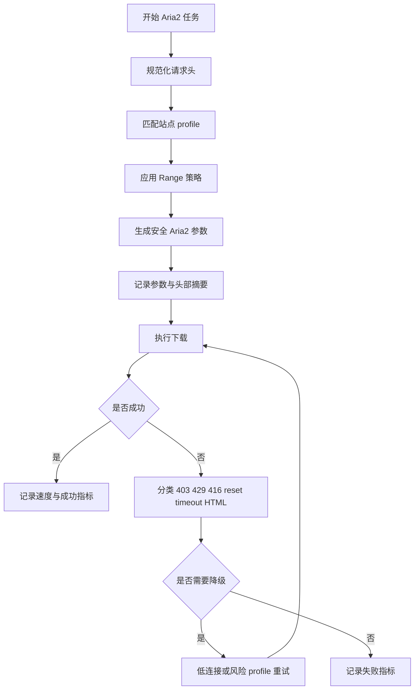

# M3U8D Aria2 安全提速函数级优化方案

## 0. 范围与边界

本文档用于指导程序员开发 Aria2 下载提速优化，仅规划，不实现业务代码。计划文件路径为 [`plans/M3U8D_Aria2安全提速函数级优化方案.md`](plans/M3U8D_Aria2安全提速函数级优化方案.md)。

本次优化覆盖 Aria2 单任务链路、请求头过滤、站点级 profile、同站点并发、诊断日志、回归测试。不得把“全局线程数”或“全局限速”作为主要优化手段，也不得默认使用 8/8 或 16/16 这类激进连接参数。

## 当前开发进度（2026-07-25）

### 状态 checklist

- [x] P0 诊断和日志增强：已完成。
- [x] P1 Aria2 Range 策略：已完成。
- [x] P0/P1 对应新增和调整测试：已完成。
- [x] P0/P1 验证命令：已通过。
- [ ] P2 Aria2 独立连接配置：暂缓。
- [ ] P3 站点级 profile：暂缓。
- [ ] P4 同站点并发限制与随机抖动：暂缓。
- [ ] P5 完整验证脚本与指标对比：暂缓，可按后续需要补充。

### 已完成内容

#### P0：Aria2 诊断日志增强

已在 [`engines/aria2_engine.py`](engines/aria2_engine.py) 和 [`utils/headers.py`](utils/headers.py) 完成诊断日志增强。当前摘要覆盖实际连接数、split、min split size、speed limit 状态、Range 状态、Cookie 状态、header_count、低连接模式、低连接回退原因、平均速度、峰值速度等信息。

日志安全边界保持不变：摘要只记录布尔值、类别、数量和脱敏信息，避免记录 Cookie、Authorization、完整敏感 URL。

#### P1：Aria2 默认剥离浏览器捕获的 Range

Aria2 请求默认剥离浏览器捕获的 Range，由 Aria2 自身管理分片、续传和 Range 探测。当前分类与剥离原因如下：

| 输入 Range 类型 | 分类 | 动作 | 原因 |
|---|---|---|---|
| Range: bytes=0- | bytes_0 | 剥离 | aria2_manages_range |
| 非零 Range | bytes_nonzero | 剥离 | nonzero_range |
| 其他不支持 Range | other | 剥离 | unsupported_range |

剥离 Range 后仍保留必要上下文请求头，包括 Referer、User-Agent、Origin、Cookie、Accept、Accept-Language 等，避免降低下载请求画像。

#### 测试与验证

新增和调整测试已覆盖 [`tests/test_engine_argv_safety.py`](tests/test_engine_argv_safety.py) 与 [`tests/test_headers.py`](tests/test_headers.py)。覆盖点包括：

- Aria2 命令不包含 Range: bytes=0-。
- Aria2 命令不包含非零 Range。
- 剥离 Range 后仍保留 Referer、User-Agent、Origin、Cookie、Accept、Accept-Language 等上下文头。
- Range 分类行为。
- 摘要不泄露 Cookie 值。
- 低连接命令测试仍通过。

验证结果：

- python -m pytest tests/test_engine_argv_safety.py tests/test_headers.py -q：71 passed。
- python -m py_compile engines/aria2_engine.py utils/headers.py tests/test_engine_argv_safety.py tests/test_headers.py：通过。

### 当前决策

先使用 P0/P1 版本测试一段时间，再决定是否继续开发后续阶段。P2-P5 当前暂缓：

- P2 Aria2 独立连接配置：暂缓。
- P3 站点级 profile：暂缓。
- P4 同站点并发限制与随机抖动：暂缓。
- P5 验证脚本与指标对比：暂缓，可按后续需要补充。

## 1. 已验证结论与问题判断

### 1.1 用户实测结论

用户已实测：程序全局线程数设为 20、全局限速设为 20M 后，Aria2 下载速度仍只有几百 KB/s。结合已有日志，当前主要瓶颈不是全局 worker 数和 speed_limit，而更可能来自以下链路：

- Aria2 单任务实际连接参数仍是 max connection per server 为 2、split 为 2、min split size 为 1M。
- 浏览器捕获的 Range 请求头被透传给 Aria2，尤其当前命令中存在 Range: bytes=0-，可能干扰 Aria2 自身的分片、续传和 Range 探测。
- 签名 CDN 可能存在单连接或单 URL 限速，盲目增加连接数可能触发 403、429、416、reset、timeout 或 HTML 错误页。
- Cookie、Referer、User-Agent、Origin 等请求头画像不足或不稳定，可能导致 CDN 返回降速链路或错误页。
- 当前日志无法充分说明低速原因，缺少 Aria2 实际参数、Range 状态、Cookie 状态、低连接回退原因、站点 profile 命中情况、同站点并发情况。

### 1.2 重要澄清

日志中的“已启动 4 个下载工作线程”表示下载任务 worker 数，相关实现位于 [`WorkerPool.start()`](core/download/worker_pool.py:134) 和 [`DownloadManager._worker()`](core/download/manager.py:1631)，不是 Aria2 单任务连接数。Aria2 单任务连接数由 [`Aria2Engine._build_command()`](engines/aria2_engine.py:271) 生成的 max connection per server 与 split 参数决定。

## 2. 优化目标与非目标

### 2.1 目标

- 在不容易触发 CDN 限速、风控和签名失效的前提下提升 Aria2 实际平均速度。
- 先让日志解释“为什么慢”，再逐步开放安全连接上限。
- 默认保持保守参数，按站点风险级别使用 profile 提升，而不是全局激进并发。
- 默认剥离 Aria2 请求中的 Range 请求头，让 Aria2 自己控制 Range 分片和续传。
- 保留必要请求头画像：Referer、User-Agent、Origin、Cookie；Authorization 继续显式授权。
- 提供可回归的测试与指标对比，避免“提速后成功率下降”。

### 2.2 非目标

- 不把全局线程数调高作为主要解决方案。
- 不把全局限速调高作为主要解决方案。
- 不默认设置 Aria2 为 8/8 或 16/16。
- 不在本文档中改任何代码文件。
- 不绕过站点授权、Cookie 安全策略或日志脱敏策略。

## 3. 当前代码关注点

| 模块 | 当前关注点 | 计划作用 |
|---|---|---|
| [`engines/aria2_engine.py`](engines/aria2_engine.py:1) | [`Aria2Engine._build_command()`](engines/aria2_engine.py:271) 当前读取 Aria2 连接配置并固定 min split size 为 1M；[`Aria2Engine._append_headers()`](engines/aria2_engine.py:361) 当前会透传 Range | 增加 profile、Range 策略、实际参数日志、低速诊断 |
| [`utils/headers.py`](utils/headers.py:1) | [`FORWARDABLE_HEADER_ALLOWLIST`](utils/headers.py:67) 包含 Range；[`sanitize_headers()`](utils/headers.py:118) 与 [`iter_engine_headers()`](utils/headers.py:360) 是头部过滤入口 | 增加面向 Aria2 的 Range 过滤策略与日志字段 |
| [`utils/config_manager.py`](utils/config_manager.py:1) | [`ConfigManager._build_default_config()`](utils/config_manager.py:318) 当前 Aria2 默认连接为 2/2；[`ConfigManager._apply_migrations()`](utils/config_manager.py:441) 可做 schema 迁移 | 增加 Aria2 独立 profile 配置与迁移 |
| [`ui/main_window_actions.py`](ui/main_window_actions.py:1) | 下载偏好 UI 的“线程数”当前写入 N_m3u8DL-RE 线程数，见 [`MainWindowActions._on_thread_count_changed()`](ui/main_window_actions.py:668) | 明确 UI 说明，避免用户误以为该线程数影响 Aria2 单任务连接 |
| [`resources/engine_rules.json`](resources/engine_rules.json:1) | 当前只含扩展名和直播平台规则 | 扩展站点级 profile、风险级别、Aria2 策略 |
| [`core/engine_rules_loader.py`](core/engine_rules_loader.py:1) | [`EngineRules`](core/engine_rules_loader.py:69) 当前只承载扩展名与直播平台 | 读取并规范化站点 profile |
| [`core/engine_selector.py`](core/engine_selector.py:1) | [`select_engine()`](core/engine_selector.py:386) 和 [`EngineSelector.get_candidates()`](core/engine_selector.py:511) 当前聚焦引擎选择 | 将站点 profile 附加到任务上下文或选择结果 |
| [`core/download/manager.py`](core/download/manager.py:1) | [`DownloadManager._normalize_task_headers_for_download()`](core/download/manager.py:1322)、[`DownloadManager._apply_site_rules_to_task()`](core/download/manager.py:1239)、[`DownloadManager._execute_download()`](core/download/manager.py:1732) 已处理头部、站点规则和下载执行 | 注入 profile、同站点并发、随机抖动、失败降级 |
| [`core/download/task_queue.py`](core/download/task_queue.py:1) | [`TaskQueue.pop_ready()`](core/download/task_queue.py:108) 当前 FIFO 出队 | 支持“暂不满足同站点并发”的延后出队或 manager 侧预检查 |
| [`core/download/worker_pool.py`](core/download/worker_pool.py:1) | [`WorkerPool.set_max_concurrent()`](core/download/worker_pool.py:187) 管全局 worker 数 | 保持其语义不变，避免误把 worker 数当作 Aria2 连接数 |

## 4. 分阶段开发方案

### P0：诊断和日志增强

#### 改动目标

先补齐可观测性，让低速问题能从日志中回答：Aria2 实际用了什么连接参数、是否透传 Range、Range 类型是什么、Cookie 是否存在、命中了哪个 profile、为什么进入低连接回退、是否出现 403/429/416/reset/timeout/HTML 错误页。

#### 涉及函数和区域

- [`Aria2Engine.download()`](engines/aria2_engine.py:143)
- [`Aria2Engine._build_command()`](engines/aria2_engine.py:271)
- [`Aria2Engine._append_headers()`](engines/aria2_engine.py:361)
- [`Aria2Engine._should_retry_low_connection()`](engines/aria2_engine.py:420)
- [`Aria2Engine._task_has_rate_limit_hint()`](engines/aria2_engine.py:406)
- [`Aria2Engine.parse_progress()`](engines/aria2_engine.py:436)
- [`DownloadManager._normalize_task_headers_for_download()`](core/download/manager.py:1322)
- [`DownloadManager._record_metric()`](core/download/manager.py:1467)

#### 实现要点

- 在 [`Aria2Engine._build_command()`](engines/aria2_engine.py:271) 中形成结构化参数摘要并记录日志：实际 max connection per server、split、min split size、retry count、speed limit 是否启用、profile 名称、profile 风险级别。
- 在 [`Aria2Engine._append_headers()`](engines/aria2_engine.py:361) 前后记录头部摘要，不记录 Cookie 值、Authorization 值、完整签名 URL。字段包括 has_range、range_kind、has_cookie、header_count、has_referer、has_user_agent、has_origin。
- Range 类型建议定义为 none、zero_start、non_zero_start、suffix、multi_range、malformed。当前 Range: bytes=0- 应标记为 zero_start。
- 在 [`Aria2Engine.download()`](engines/aria2_engine.py:143) 中汇总本次下载结果：平均速度、峰值速度、最低连接数、回退次数、最后错误分类。
- 在 [`Aria2Engine.parse_progress()`](engines/aria2_engine.py:436) 中保留现有进度解析，并扩展对 CN、DL、SPD 的采样统计。若不改变返回结构，可在 engine 内部维护线程本地统计，避免破坏 UI。
- 在 [`Aria2Engine._should_retry_low_connection()`](engines/aria2_engine.py:420) 中输出匹配到的关键词或状态码，避免只知道“触发了回退”但不知道原因。
- 在 [`DownloadManager._record_metric()`](core/download/manager.py:1467) 中增加 Aria2 相关分类字段，或在 Aria2 自身日志中输出同样字段，便于后续脚本统计。

#### 风险控制

- 只记录布尔值、长度、类别和脱敏 URL，不记录 Cookie、Authorization、签名 query 原文。
- 不改变下载参数和请求头行为，只增加日志与统计。
- 进度统计不得阻塞 stdout/stderr 读取链路。

#### 验收标准

- 启动任意 Aria2 下载时，日志必须能看到实际 max connection per server、split、min split size。
- 日志必须能看到 has_range、range_kind、has_cookie、header_count。
- 失败或低速回退时，日志必须能看到低连接回退原因。
- 能区分 403、429、416、reset、timeout、HTML 错误页等原因。

#### 测试建议

- 在 [`tests/test_engine_argv_safety.py`](tests/test_engine_argv_safety.py:1) 增加断言：日志摘要不泄露 Cookie/Authorization，且命令参数仍通过列表传参。
- 在 [`tests/test_headers.py`](tests/test_headers.py:1) 增加 Range 分类测试。
- 增加针对 [`Aria2Engine.parse_progress()`](engines/aria2_engine.py:436) 的单元测试，覆盖 CN、DL、SPD 采样。

### P1：Aria2 Range 策略

#### 改动目标

默认剥离 Aria2 请求中的 Range 请求头，尤其剥离非零 Range，避免浏览器捕获的 Range 干扰 Aria2 自身分片和续传。保留必要的 Referer、User-Agent、Origin、Cookie；Authorization 仍需显式授权。

#### 涉及函数和区域

- [`Aria2Engine._append_headers()`](engines/aria2_engine.py:361)
- [`Aria2Engine._build_command()`](engines/aria2_engine.py:271)
- [`sanitize_headers()`](utils/headers.py:118)
- [`iter_engine_headers()`](utils/headers.py:360)
- [`normalized_forward_headers()`](utils/headers.py:330)
- [`DownloadManager._normalize_task_headers_for_download()`](core/download/manager.py:1322)

#### 实现要点

- 在 [`utils/headers.py`](utils/headers.py:1) 新增面向 engine 的 Range 策略入口，建议不要从全局白名单中简单删除 Range，因为其他引擎或诊断可能仍需要识别它。
- [`iter_engine_headers()`](utils/headers.py:360) 已有 include_range 参数，应让 Aria2 调用路径默认 include_range 为 False，或者在 [`Aria2Engine._append_headers()`](engines/aria2_engine.py:361) 中调用等价过滤入口。
- [`Aria2Engine._append_headers()`](engines/aria2_engine.py:361) 默认不再把 range 放入 generic header 列表。
- 如果必须兼容特殊站点，可通过站点 profile 显式允许 Range passthrough，但默认只允许 zero_start，并禁止 non_zero_start、suffix、multi_range。
- 如果 Range 被剥离，记录 aria2_range_policy 日志，字段包括 original_range_present、range_kind、action、reason、profile。
- Cookie 策略保持现状：有 Cookie 且策略允许时继续转发，但日志只记录 has_cookie 和 cookie_len，不记录值。

#### 风险控制

- 默认剥离 Range 可能影响极少数要求 Range: bytes=0- 的服务器，因此提供站点级 profile 允许例外。
- 对非零 Range 默认强制剥离，因为它最容易导致 416 或只下载尾段。
- 不改变 N_m3u8DL-RE、yt-dlp、Streamlink 的头部行为，避免跨引擎回归。

#### 验收标准

- 默认 Aria2 命令中不出现 Range header。
- Referer、User-Agent、Origin、Cookie 仍按策略保留。
- 若输入 Range: bytes=0-，日志标记 zero_start 且 action 为 drop。
- 若输入 Range: bytes=1000-，日志标记 non_zero_start 且 action 为 drop。
- 兼容 profile 显式启用时，只有 zero_start 可透传，非零 Range 仍被拒绝。

#### 测试建议

- 在 [`tests/test_engine_argv_safety.py`](tests/test_engine_argv_safety.py:1) 增加 Aria2 命令构造测试：默认不含 Range header。
- 在 [`tests/test_headers.py`](tests/test_headers.py:1) 增加 include_range 为 False 时剥离 Range 的测试。
- 增加 Cookie、Referer、User-Agent、Origin 保留测试，确认 P1 不降低请求头画像。

### P2：Aria2 独立连接配置与安全上限

#### 改动目标

引入 Aria2 独立连接 profile，不再依赖 UI 全局线程数。默认保持 2/2；可信站点可提升到 3/3 或 4/4；风险站点降为 1/1 或 2/2。min split size 默认保持 1M，允许 profile 覆盖为 2M 或 4M。

#### 涉及函数和区域

- [`Aria2Engine._build_command()`](engines/aria2_engine.py:271)
- [`Aria2Engine._task_has_rate_limit_hint()`](engines/aria2_engine.py:406)
- [`Aria2Engine._should_retry_low_connection()`](engines/aria2_engine.py:420)
- [`ConfigManager._build_default_config()`](utils/config_manager.py:318)
- [`ConfigManager._apply_migrations()`](utils/config_manager.py:441)
- [`MainWindowActions._on_thread_count_changed()`](ui/main_window_actions.py:668)

#### 实现要点

- 在 [`ConfigManager._build_default_config()`](utils/config_manager.py:318) 增加 Aria2 独立 profile 配置：risk、default、trusted 三档，包含 max connection per server、split、min split size、range policy、same site concurrency、cookie policy。
- 将配置 schema 从当前 [`CONFIG_SCHEMA_VERSION`](utils/config_manager.py:30) 递增，并在 [`ConfigManager._apply_migrations()`](utils/config_manager.py:441) 中补齐旧配置。
- [`Aria2Engine._build_command()`](engines/aria2_engine.py:271) 根据 task 上的 profile 或默认 profile 读取连接参数，并做硬上限钳制：risk 最大 2，default 最大 2，trusted 最大 4。
- connection override 仍用于低连接回退，但回退值不得超过当前 profile 上限。
- 保留现有低连接回退功能。若 [`Aria2Engine._task_has_rate_limit_hint()`](engines/aria2_engine.py:406) 命中 429、reset、timeout、HTML 错误页等，应自动选择更保守配置。
- UI 中“线程数”继续写 N_m3u8DL-RE 线程数，但需要在 [`ui/main_window_actions.py`](ui/main_window_actions.py:185) 下载偏好区域增加说明：该线程数不是 Aria2 单任务连接数。
- 若新增 Aria2 连接配置 UI，应放在高级设置或折叠区，不建议直接暴露 16 以上范围；范围建议 1 至 4。

#### 风险控制

- 默认 profile 不提到 8/8 或 16/16。
- 可信站点 4/4 作为上限，不作为默认。
- 检测到 403、429、416、reset、timeout 后自动降级到低连接 profile。
- profile 参数与用户配置取最小安全值，避免用户误配导致风控。

#### 验收标准

- 默认 Aria2 命令仍为 2/2/1M，但日志标明来自 default profile。
- trusted profile 可生成 3/3 或 4/4，但不能超过 4/4。
- risk profile 可生成 1/1 或 2/2。
- UI 文案明确解释“线程数”与 Aria2 单任务连接数不是一回事。

#### 测试建议

- 在 [`tests/test_engine_argv_safety.py`](tests/test_engine_argv_safety.py:1) 增加三档 profile 参数测试。
- 在 [`tests/test_download_manager_state_machine.py`](tests/test_download_manager_state_machine.py:1) 增加低连接回退后参数降级测试。
- 增加配置迁移测试，可放入现有配置测试文件或新增针对 [`ConfigManager._apply_migrations()`](utils/config_manager.py:441) 的测试。

### P3：站点级 profile

#### 改动目标

通过站点规则按域名区分风险站点、默认站点、可信站点，并把 profile 传递给 Aria2。避免所有站点共用同一连接策略。

#### 涉及函数和区域

- [`resources/engine_rules.json`](resources/engine_rules.json:1)
- [`EngineRules`](core/engine_rules_loader.py:69)
- [`_load_engine_rules_from_disk()`](core/engine_rules_loader.py:125)
- [`reload_engine_rules()`](core/engine_rules_loader.py:188)
- [`select_engine()`](core/engine_selector.py:386)
- [`EngineSelector.get_candidates()`](core/engine_selector.py:511)
- [`DownloadManager._apply_site_rules_to_task()`](core/download/manager.py:1239)
- [`DownloadManager._execute_download()`](core/download/manager.py:1732)

#### 实现要点

- 在 [`resources/engine_rules.json`](resources/engine_rules.json:1) 增加 aria2_profiles 或 site_profiles 配置区域，字段建议包含 domains、risk_level、aria2_profile、range_policy、cookie_policy、same_site_concurrency、notes。
- 在 [`EngineRules`](core/engine_rules_loader.py:69) 增加 profile 数据结构，加载时做域名规范化、优先级排序、默认值合并。
- 在 [`core/engine_rules_loader.py`](core/engine_rules_loader.py:1) 新增 profile schema 校验：未知 risk_level 降为 default；非法连接参数被忽略或钳制。
- 在 [`select_engine()`](core/engine_selector.py:386) 或 [`EngineSelector.get_candidates()`](core/engine_selector.py:511) 中不改变引擎选择结果，只把匹配到的 Aria2 profile 作为上下文附加给 task 或 decision。
- 在 [`DownloadManager._execute_download()`](core/download/manager.py:1732) 中执行下载前把 profile 写入 task 的临时字段，例如 aria2_profile、site_risk_level、range_policy、same_site_concurrency。
- 当前 [`site_rule_utils.iter_matching_site_rules()`](core/site_rule_utils.py:119) 已有站点匹配能力，可复用其域名与优先级思想，避免重复实现不一致的匹配逻辑。

#### 风险控制

- profile 只影响 Aria2，不影响 N_m3u8DL-RE 默认 HLS 行为，除非明确配置 HLS 线程策略。
- 站点规则缺失或加载失败时回退 default profile。
- 规则文件格式错误不得阻断下载，应记录 warning 并使用内置默认。

#### 验收标准

- 风险站点命中 risk profile，Aria2 命令为 1/1 或 2/2。
- 可信站点命中 trusted profile，Aria2 命令最高可为 4/4。
- 未命中规则时使用 default profile。
- 日志能看到 site_profile、risk_level、matched_domain、profile_source。

#### 测试建议

- 在 [`tests/test_engine_selector.py`](tests/test_engine_selector.py:1) 增加站点 profile 命中与未命中测试。
- 在 [`tests/test_engine_argv_safety.py`](tests/test_engine_argv_safety.py:1) 增加 profile 传入 Aria2 后的命令参数测试。
- 增加 [`reload_engine_rules()`](core/engine_rules_loader.py:188) 对非法规则回退的测试。

### P4：同站点并发限制与随机抖动

#### 改动目标

降低同一 CDN 或同一站点同时启动多个 Aria2 任务时触发限速和风控的概率。通过同站点并发限制、启动随机抖动、失败后降级 profile 来实现温和提速。

#### 涉及函数和区域

- [`DownloadManager.__init__()`](core/download/manager.py:272)
- [`DownloadManager._worker()`](core/download/manager.py:1631)
- [`DownloadManager._execute_download()`](core/download/manager.py:1732)
- [`TaskQueue.pop_ready()`](core/download/task_queue.py:108)
- [`WorkerPool.set_max_concurrent()`](core/download/worker_pool.py:187)

#### 实现要点

- 在 [`DownloadManager.__init__()`](core/download/manager.py:272) 中新增同站点运行计数结构，按 registrable domain 或 host 计数。
- 在 [`DownloadManager._worker()`](core/download/manager.py:1631) 出队前判断候选任务站点是否超过 profile 的 same site concurrency。若超过，优先选择队列中其他可运行任务；若没有可运行任务，则等待。
- 如果修改 [`TaskQueue.pop_ready()`](core/download/task_queue.py:108) 风险较高，可先在 manager 侧实现 snapshot 扫描和 remove，再后续抽象为 pop_ready(predicate)。
- 在 [`DownloadManager._execute_download()`](core/download/manager.py:1732) 启动引擎前按 profile 增加短随机抖动，风险站点抖动更明显，可信站点较小。
- 当同站点出现 403、429、416、reset、timeout、HTML 错误页时，记录 host 级冷却状态，后续一段时间内使用 risk 或 low connection profile。
- [`WorkerPool.set_max_concurrent()`](core/download/worker_pool.py:187) 仍只管理全局 worker，不承载站点并发逻辑，避免职责混乱。

#### 风险控制

- 同站点限制只影响排队顺序，不取消任务。
- 随机抖动必须可配置、可关闭，并且响应停止请求。
- 对暂停、停止、删除任务必须释放站点运行计数，避免永久占用。
- 不在持锁状态下 sleep。

#### 验收标准

- 同一风险站点最多同时运行 1 个或 2 个 Aria2 任务，具体由 profile 决定。
- 不同站点任务仍可并行运行。
- 日志能看到 same_site_concurrency_limit、host_running_count、jitter_ms、cooldown_reason。
- 任务完成、失败、停止后站点计数释放。

#### 测试建议

- 在 [`tests/test_download_manager_state_machine.py`](tests/test_download_manager_state_machine.py:1) 增加同站点并发限制测试。
- 增加停止和失败路径释放站点计数测试。
- 增加随机抖动可关闭测试，避免单测不稳定。

### P5：验证脚本、回归测试、指标对比

#### 改动目标

形成可重复验证流程，比较优化前后速度、错误率、回退次数和请求头状态，确认提速不是以成功率下降为代价。

#### 涉及文件和区域

- [`tests/test_engine_argv_safety.py`](tests/test_engine_argv_safety.py:1)
- [`tests/test_headers.py`](tests/test_headers.py:1)
- [`tests/test_engine_selector.py`](tests/test_engine_selector.py:1)
- [`tests/test_download_manager_state_machine.py`](tests/test_download_manager_state_machine.py:1)
- 可参考现有指标脚本 [`scripts/s5_metrics_from_logs.py`](scripts/s5_metrics_from_logs.py:1)
- 可参考现有对比脚本 [`scripts/s5_compare_metrics.py`](scripts/s5_compare_metrics.py:1)

#### 实现要点

- 增加日志解析脚本或扩展现有脚本，提取 Aria2 参数、Range 状态、Cookie 状态、profile 命中、速度统计、错误分类。
- 固定同一测试 URL 进行优化前后对比，但必须注意签名 URL TTL，过期 URL 不能作为失败证据。
- 输出对比表：平均速度、峰值速度、成功率、403/429/416 次数、reset/timeout 次数、HTML 错误页次数、低连接回退次数。
- 回归测试覆盖命令参数安全、头部过滤、站点 profile、下载状态机。

#### 风险控制

- 测速只作为指标，不在测试中依赖外网稳定速度做硬断言。
- 单元测试使用构造命令和模拟日志，不依赖真实 aria2c。
- 对 Cookie 和签名 URL 全程脱敏。

#### 验收标准

- P0+P1 最小版本通过所有新增单元测试。
- 默认 Aria2 命令不含 Range，且保留必要请求头。
- 日志解析脚本能输出完整指标表。
- 对比报告能清楚说明速度变化与错误变化。

## 5. 最终推荐参数表

| 站点类型 | Aria2 max connection per server | Aria2 split | min split size | HLS 线程 | 全局并发 | 同站点并发 | Range 策略 | Cookie 策略 |
|---|---:|---:|---:|---:|---:|---:|---|---|
| 风险站点 | 1 或 2 | 1 或 2 | 1M 到 4M | 1 到 4 | 1 到 2 | 1 | 默认剥离全部 Range；禁止非零 Range | 仅同站点或站点规则授权时转发；只记录 has_cookie |
| 默认站点 | 2 | 2 | 1M | 4 到 8 | 2 | 1 到 2 | 默认剥离全部 Range；特殊 profile 可保留 zero_start | 按现有策略转发 Cookie；不记录值 |
| 可信站点 | 3 或 4 | 3 或 4 | 1M 到 2M | 8 到 16 | 2 到 3 | 2 | 默认仍剥离 Range；仅明确兼容时保留 zero_start | 可按站点规则稳定转发 Cookie；继续脱敏 |

说明：

- Aria2 默认推荐仍是 2/2/1M，不使用 8/8 或 16/16 作为默认值。
- HLS 线程主要影响 N_m3u8DL-RE，不等于 Aria2 单任务连接数。
- 全局并发是下载任务 worker 上限，不等于单任务 Aria2 连接数。
- 可信站点的 4/4 是安全上限，不是全局默认。

## 6. 验证指标与日志字段

### 6.1 速度指标

- avg_speed：单任务平均速度。
- peak_speed：单任务峰值速度。
- speed_samples：采样数量。
- cn_min、cn_max、cn_last：Aria2 CN 连接数统计。
- elapsed_seconds：任务耗时。

### 6.2 错误指标

- http_403_count。
- http_429_count。
- http_416_count。
- reset_count。
- timeout_count。
- html_error_page_count。
- aria2_exit_code。
- failure_kind。
- probe_stage。

### 6.3 请求头与参数字段

- has_range。
- range_kind。
- range_action。
- has_cookie。
- cookie_len。
- header_count。
- has_referer。
- has_user_agent。
- has_origin。
- aria2_max_connection_per_server。
- aria2_split。
- aria2_min_split_size。
- aria2_profile。
- site_risk_level。
- matched_domain。
- same_site_running_count。
- same_site_concurrency_limit。

### 6.4 回退与降级字段

- low_connection_retry_count。
- low_connection_reason。
- cooldown_reason。
- profile_downgraded_from。
- profile_downgraded_to。
- retry_action。

## 7. 推荐实施顺序与工作量等级

> 为遵守规划约束，本文不提供小时、天、周等时间估算，只给出非时间化的工作量等级：小、中、大。

| 顺序 | 阶段 | 工作量等级 | 说明 |
|---:|---|---|---|
| 1 | P0 诊断和日志增强 | 中 | 最小可交付版本必须先做，解决“日志解释不了为什么慢”的问题 |
| 2 | P1 Aria2 Range 策略 | 小到中 | 最小可交付版本必须先做，当前最可疑且风险可控 |
| 3 | P5 中与 P0/P1 对应的测试 | 中 | 与 P0/P1 同步完成，避免改动不可验证 |
| 4 | P2 Aria2 独立连接配置 | 中 | 在确认 Range 行为后再开放 3/3 或 4/4 |
| 5 | P3 站点级 profile | 大 | 需要规则 schema、加载器、选择器和任务上下文联动 |
| 6 | P4 同站点并发限制与随机抖动 | 大 | 涉及调度策略和状态释放，必须有状态机测试 |
| 7 | P5 完整验证脚本与对比报告 | 中 | 完成全链路指标闭环 |

最小可交付版本优先做 P0 + P1 + 对应测试。这样即使暂不提升连接数，也能验证 Range 透传是否是几百 KB/s 的核心原因，并保留回滚空间。

## 8. 建议开发流程图

## 9. 程序员开发 checklist

### P0 checklist

- [ ] 在 [`Aria2Engine._build_command()`](engines/aria2_engine.py:271) 输出实际 Aria2 参数摘要。
- [ ] 在 [`Aria2Engine._append_headers()`](engines/aria2_engine.py:361) 输出头部摘要与 Range 分类。
- [ ] 在 [`Aria2Engine.download()`](engines/aria2_engine.py:143) 汇总平均速度、峰值速度和低连接回退次数。
- [ ] 在 [`Aria2Engine._should_retry_low_connection()`](engines/aria2_engine.py:420) 输出回退原因。
- [ ] 在 [`Aria2Engine.parse_progress()`](engines/aria2_engine.py:436) 增加 CN、DL、SPD 采样能力。

### P1 checklist

- [ ] 在 [`utils/headers.py`](utils/headers.py:1) 增加 Range 分类与 engine 级过滤入口。
- [ ] 调整 [`Aria2Engine._append_headers()`](engines/aria2_engine.py:361)，默认不向 aria2c 透传 Range。
- [ ] 保留 Referer、User-Agent、Origin、Cookie 的安全转发。
- [ ] 对 zero_start、non_zero_start、suffix、multi_range、malformed 写测试。

### P2 checklist

- [ ] 在 [`ConfigManager._build_default_config()`](utils/config_manager.py:318) 增加 Aria2 profile 默认值。
- [ ] 在 [`ConfigManager._apply_migrations()`](utils/config_manager.py:441) 增加配置迁移。
- [ ] 在 [`Aria2Engine._build_command()`](engines/aria2_engine.py:271) 根据 profile 生成连接参数并做安全钳制。
- [ ] 在 [`ui/main_window_actions.py`](ui/main_window_actions.py:185) 增加 UI 说明，解释线程数与 Aria2 连接数不同。

### P3 checklist

- [ ] 扩展 [`resources/engine_rules.json`](resources/engine_rules.json:1) 的站点级 profile schema。
- [ ] 扩展 [`EngineRules`](core/engine_rules_loader.py:69) 和 [`_load_engine_rules_from_disk()`](core/engine_rules_loader.py:125)。
- [ ] 在 [`select_engine()`](core/engine_selector.py:386) 或 [`EngineSelector.get_candidates()`](core/engine_selector.py:511) 暴露 profile 命中信息。
- [ ] 在 [`DownloadManager._execute_download()`](core/download/manager.py:1732) 写入 task profile 临时字段。

### P4 checklist

- [ ] 在 [`DownloadManager.__init__()`](core/download/manager.py:272) 增加同站点计数状态。
- [ ] 在 [`DownloadManager._worker()`](core/download/manager.py:1631) 增加同站点并发准入判断。
- [ ] 必要时扩展 [`TaskQueue.pop_ready()`](core/download/task_queue.py:108) 支持 predicate 出队。
- [ ] 在 [`DownloadManager._execute_download()`](core/download/manager.py:1732) 启动前增加可取消随机抖动。
- [ ] 完成状态释放与失败降级测试。

### P5 checklist

- [ ] 扩展 [`tests/test_engine_argv_safety.py`](tests/test_engine_argv_safety.py:1)。
- [ ] 扩展 [`tests/test_headers.py`](tests/test_headers.py:1)。
- [ ] 扩展 [`tests/test_engine_selector.py`](tests/test_engine_selector.py:1)。
- [ ] 扩展 [`tests/test_download_manager_state_machine.py`](tests/test_download_manager_state_machine.py:1)。
- [ ] 扩展或新增日志指标脚本，参考 [`scripts/s5_metrics_from_logs.py`](scripts/s5_metrics_from_logs.py:1) 和 [`scripts/s5_compare_metrics.py`](scripts/s5_compare_metrics.py:1)。

## 10. 交付边界

本方案只要求创建或更新 [`plans/M3U8D_Aria2安全提速函数级优化方案.md`](plans/M3U8D_Aria2安全提速函数级优化方案.md)，不修改 [`engines/aria2_engine.py`](engines/aria2_engine.py:1)、[`utils/headers.py`](utils/headers.py:1)、[`utils/config_manager.py`](utils/config_manager.py:1)、[`ui/main_window_actions.py`](ui/main_window_actions.py:1)、[`resources/engine_rules.json`](resources/engine_rules.json:1)、[`core/engine_rules_loader.py`](core/engine_rules_loader.py:1)、[`core/engine_selector.py`](core/engine_selector.py:1)、[`core/download/manager.py`](core/download/manager.py:1)、[`core/download/task_queue.py`](core/download/task_queue.py:1)、[`core/download/worker_pool.py`](core/download/worker_pool.py:1) 或任何测试文件。
